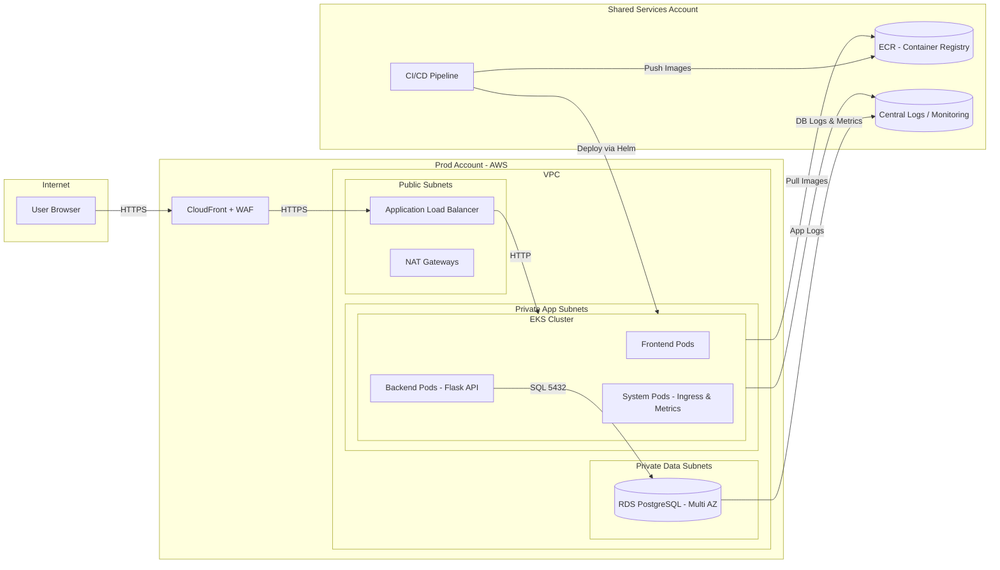

# Innovate Inc.

## 1. Overview

Innovate Inc. is building a web application consisting of:

- **Backend**: Python / Flask – REST API  
- **Frontend**: React SPA  
- **Database**: PostgreSQL  
- **Requirements**:
  - Low initial traffic → potential to scale to **millions of users**
  - **Sensitive user data** → strong security & compliance posture
  - **CI/CD** and continuous deployments
  - Managed Kubernetes and managed database services
  - Cost-efficient, but with a clear growth path

This document describes a proposed **AWS architecture** using **EKS** for compute and **Amazon RDS (PostgreSQL)** for data, following multi-account, networking, security, and reliability best practices.

## 2. Cloud Environment Structure

### 2.1 AWS Accounts

We use a **multi-account** setup under a single **AWS Organization** to achieve isolation, security, and clear billing.

Recommended accounts:

1. **Shared Services Account**
2. **Dev Account**
3. **Staging Account**
4. **Production Account**

Reasons:
- Isolation
- Security
- Billing separation  
- Compliance

---

## 3. Network Design

### 3.1 VPC Architecture (per environment)

- VPC CIDR: `10.0.0.0/16`
- **Public subnets**: ALB, NAT
- **Private app subnets**: EKS nodes
- **Private data subnets**: RDS

### 3.2 Security

- SG for ALB, EKS nodes, RDS
- VPC endpoints for S3, ECR, CloudWatch
- No public DB access
- NAT gateways per AZ

---

## 4. Compute Platform – Kubernetes (EKS)

### 4.1 EKS Cluster

- One EKS cluster per environment
- Private endpoint
- Namespaces by function (`frontend`, `backend`, `infra`, etc.)

### 4.2 Node Groups & Scaling

- x86 and ARM node groups
- Optional Karpenter
- HPA for pods
- ResourceQuotas

---

## 5. Containerization & CI/CD

### 5.1 Containerization

- Multi-stage Dockerfiles for backend & frontend
- Non-root containers
- Security scanning (Trivy/Grype)

### 5.2 ECR

- Image scanning
- Lifecycle policies

### 5.3 CI/CD Pipeline

Stages:
- Build & test
- Security scan
- Push to ECR
- Deploy to EKS via Helm/kubectl or GitOps

Secrets in AWS Secrets Manager.

---

## 6. Database – PostgreSQL

### 6.1 Amazon RDS

- Start with RDS PostgreSQL
- Optionally move to Aurora PostgreSQL later

### 6.2 Backups & DR

- Multi-AZ
- PITR
- Snapshot replication to another region

---

## 7. Security

- IRSA for pods
- KMS encryption
- HTTPS everywhere
- AWS WAF
- CloudTrail, GuardDuty, Security Hub

---

## 8. Observability

- CloudWatch Logs
- Prometheus + Grafana
- ALB logs to S3
- Centralized logs in Shared Services account

---

## 9. Cost Optimization

- Graviton nodes
- Autoscaling
- ECR cleanup
- RDS right-sizing
- Savings Plans

---

## 10. High-Level Architecture Diagram

